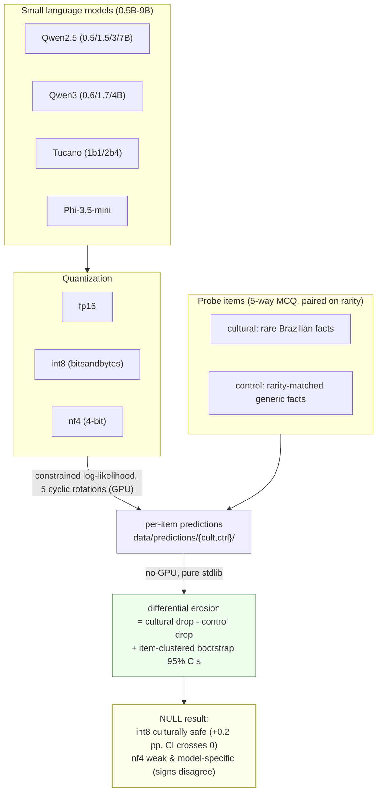

# CulturaQuant: Quantization and Brazilian Cultural Knowledge in Small Language Models

> Paper: Cristhian Kapelinski, Dionatan Schmidt, Aline Lunkes, Diego Kreutz.
> *Anais do XXII Encontro Nacional de Inteligencia Artificial e Computacional (ENIAC 2026)*. SBC, 2026.

Does quantizing a small language model quietly cost it more Brazilian cultural
knowledge than generic world knowledge? This artifact reproduces the measurement
and the statistical analysis behind the answer.

## The question

Quantization is how a small language model (0.5B–9B parameters) gets small enough
to run on a phone, a laptop, or a cheap GPU: you trade some numerical precision for
a fraction of the memory. The worry that started this work is that the trade might
not be neutral. If a model only barely knows that a given town is in the state of
Amazonas, that fragile, low-frequency fact could be exactly what gets rounded away
first when you drop from 16-bit to 8-bit or 4-bit weights. And in Brazilian
Portuguese, a lot of *cultural* knowledge (who was born where, which festival
happens in which state) is precisely that kind of rare, long-tail fact.

So we asked a sharp version of it: **on identical inputs, does Brazilian cultural
knowledge erode faster under quantization than equally rare generic world
knowledge?** "Equally rare" is the whole game. If cultural facts are simply rarer
than control facts, any extra loss is about rarity, not culture. To rule that out
we pair every cultural item with a non-Brazilian item matched on Wikidata rarity,
and we report **differential erosion**: the cultural-accuracy drop *minus* the
matched-control drop, in percentage points. A uniform compression hit that lowers
both equally lands near zero by construction; the design cannot manufacture a
"culture erodes first" headline out of a flat drop.

## How it works

Each item is a single-correct, five-way multiple-choice question (random floor
0.20). We score every model at three precisions (FP16, bitsandbytes int8, and NF4
4-bit) with deterministic constrained log-likelihood (argmax over the option
log-probabilities, no sampling), rotating the five options cyclically so the gold
answer is never pinned to one slot. That scoring step is the only part that needs a
GPU, and it produces the **run of record**: one JSONL of per-item predictions per
(model, precision), committed here in `data/predictions/`. Everything downstream
(the erosion, the confidence intervals, the null) is pure Python standard library
reading those JSONLs back, which is what makes the headline auditable on any laptop.



One more guardrail before any model "counts": five of the eleven models sit at the
five-way chance floor at full precision (Wilson 95% lower bound below 0.20), so they
have no signal to lose. We report those as **unmeasurable**, not as nulls, and the
erosion claims are made only on the six measurable models (the three larger Qwen2.5,
two Qwen3, and Phi-3.5-mini).

## What we found

**The headline is a null, and it is the clean kind.** Eight-bit quantization does
*not* erode Brazilian cultural knowledge faster than the rarity-matched control. The
pooled int8 differential is **+0.2 pp** with a 95% item-clustered bootstrap CI of
**[−0.4, 0.7]**; every per-model interval crosses zero; and the design's minimum
detectable effect is about **1.8 pp**, so this is a powered null, not silence. In
plain terms: **int8 is culturally safe.**

Four-bit (NF4) is the more interesting non-story. It is not a larger cultural loss;
it is *model-specific and unstable*. The pooled nf4 differential is **+0.7 pp**
([−0.1, 1.6]), but the per-model signs openly disagree: the three Qwen2.5 models
erode cultural knowledge faster by **3.1–3.5 pp**, Qwen3-1.7B erodes it *slower* by
**3.6 pp**, and Qwen3-4B and Phi-3.5 show essentially nothing. That is the fingerprint
of a brittle 4-bit method bouncing model to model, not a systematic cultural penalty.
**nf4 is weak and inconsistent.**

| precision | pooled differential (pp) | 95% CI | reading |
|---|---|---|---|
| int8 | **+0.2** | [−0.4, 0.7] | culturally safe (powered null, MDE ≈ 1.8 pp) |
| nf4 | **+0.7** | [−0.1, 1.6] | model-specific, signs disagree (−3.6 to +3.5 pp) |

Two side findings reinforce that the null is real and not an artifact: cultural drop
does **not** grow monotonically with rarity band (int8 stays flat across all seven
bands; nf4 is scattered, not increasing), and **no Brazilian macro-region erodes
first** (the North/Northeast vs Southeast/South contrast is within noise). Full-
precision accuracy *does* climb smoothly with item frequency (21% on the rarest band
to 52% on the most common), which is a sanity check that the probe measures knowledge.
That gradient just does not translate into a quantization-induced cultural penalty.

## Reproduce it yourself

One command, **no GPU, no network, no install**: it re-analyzes the committed
predictions, prints all the tables above, and then asserts the regenerated LaTeX
macros are byte-identical to the committed reference:

```bash
python3 reproduce.py
```

That is pure Python standard library, so a bare `python3` (3.10+) is enough; there is
nothing to `pip install` for this path. An identical bash entry point exists if you
prefer it:

```bash
./reproduce.sh
```

**Expected wall-clock:** under a minute on a laptop (≈40 s, dominated by the 10,000-
sample bootstrap), well under 20 MB of RAM.

**Expected output (tail):** the per-model differential-erosion table, the pooled
**int8 +0.2 pp [−0.4, 0.7]** and **nf4 +0.7 pp [−0.1, 1.6]**, **MDE 1.8 pp**, the
fp16 RStd range **0.120 to 0.198**, **6 of 11 models measurable**, and a final line:

```
== regenerate macros and verify byte-identical ==
OK_MACROS_REPRODUCED (all macros byte-identical to results/results_macros.tex)
```

If you want the individual pieces instead of the bundle, each script defaults to the
committed predictions and prints its own table:

```bash
python3 analysis/cq_ci.py            # per-model + pooled differential erosion with CIs, MDE
python3 analysis/cq_rstd.py          # position-choice spread (RStd) per measurable model
python3 analysis/cq_full_analysis.py # measurable set + per-band / per-region cultural drops
python3 analysis/cq_calib.py         # full-precision calibration gradient by rarity band
```

There is also a notebook, `reproduce.ipynb`, that runs the same no-GPU path cell by
cell if you would rather read the numbers interactively.

## The data

The run of record lives in `data/predictions/`: **66 JSONL files** (11 models x 3
precisions × 2 groups), each with 3,500 lines (700 items × 5 cyclic rotations).
Every prediction line records the item id, the rotation, the gold and predicted
option, whether it was correct, and the five option log-probabilities, so the scoring
is fully inspectable, not just a final accuracy:

```json
{"id": "v2-mb-001", "group": "cultural", "rotation": 0, "gold": 0, "pred": 1,
 "correct": 0, "logprobs": [-2.21965, -0.40715, -5.01652, -2.73527, -4.40715]}
```

The probe itself is the paper's central contribution and ships in `data/items/`:
`cultural.jsonl` (700 rare Brazilian facts from Wikidata, tagged by macro-region and
rarity band) and `control.jsonl` (700 rarity-matched non-Brazilian facts, each linked
to its cultural partner by `matched_br_id`). Both carry Wikidata QIDs, source URLs,
and gold-verification flags; `docs/DATASET.md` documents the schema, the region and
rarity balance, and the honest scope of the probe. `docs/ARCHITECTURE.md` walks the
two-stage pipeline and why the analysis is decoupled from the GPU scoring.

## Run from scratch (GPU)

If you want to regenerate the predictions rather than trust the committed ones, the
scoring grid is one command on a GPU host (≥16 GB) after installing the environment:

```bash
curl -LsSf https://astral.sh/uv/0.11.2/install.sh | sh   # install uv (~10 s)
uv sync --extra dev                                       # resolve from uv.lock (~3 min)
./rescore.sh                                              # 11 models x 3 precisions x 2 groups
```

`rescore.sh` scores all 11 models at FP16/int8/NF4 over both item groups with the same
deterministic constrained log-likelihood and 5 cyclic rotations, is resumable (a
finished (model, precision) file is skipped), writes into `data/predictions/`, and then
re-runs the no-GPU analysis on the fresh grid. Expect several hours on one 16 GB GPU
plus first-run model downloads, and the same pooled **int8 +0.2 pp / nf4 +0.7 pp /
MDE 1.8 pp** out the other end. A pinned Docker image is provided (`Dockerfile`, with
`Dockerfile.blackwell` for newer GPUs) so the whole scoring run is contained; growing
data (model cache, predictions) is bind-mounted, never baked into the image. The unit
tests for the scorer and the option-permutation logic run with `./scripts/test.sh`
(no GPU needed).

## Citation

If you use this artifact in your work, please cite the paper:

> Cristhian Kapelinski, Dionatan Schmidt, Aline Lunkes, and Diego Kreutz.
> **CulturaQuant: Quantization and Brazilian Cultural Knowledge in Small Language Models.**
> In *Anais do XXII Encontro Nacional de Inteligencia Artificial e Computacional (ENIAC 2026)*. SBC, 2026.

```bibtex
@inproceedings{kapelinski2026culturaquant,
  author = {Kapelinski, Cristhian and Schmidt, Dionatan and Lunkes, Aline and Kreutz, Diego},
  title = {{CulturaQuant}: Quantization and {B}razilian Cultural Knowledge in Small Language Models},
  booktitle = {Anais do XXII Encontro Nacional de Intelig{\^e}ncia Artificial e Computacional (ENIAC 2026)},
  year = {2026},
  publisher = {SBC}
}
```

## License

MIT; see `LICENSE`. The probe, the control, and the predictions are all released
under it.
